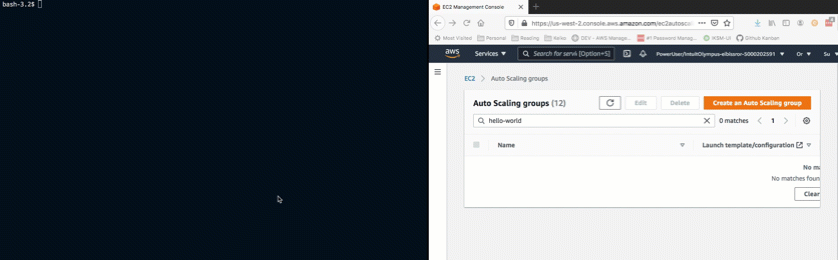

# instance-manager


[](https://codecov.io/gh/keikoproj/instance-manager)
[](https://goreportcard.com/report/github.com/keikoproj/instance-manager)
[][SlackUrl]

> Create and manage instance groups with Kubernetes.

**instance-manager** simplifies the creation of worker nodes from within a Kubernetes cluster and creates `InstanceGroup` objects in your cluster. Additionally, **instance-manager** will provision the actual machines and bootstrap them to the cluster.


- [instance-manager](#instance-manager)
  - [Installation](#installation)
  - [Usage example](#usage-example)
    - [Currently supported provisioners](#currently-supported-provisioners)
    - [Submit and Verify](#submit-and-verify)
    - [Alpha-2 Version](#alpha-2-version)
  - [Contributing](#contributing)
  - [Developer Guide](#developer-guide)

Worker nodes in Kubernetes clusters work best if provisioned and managed using a logical grouping. Kops introduced the term “InstanceGroup” for this logical grouping. In AWS, an InstanceGroup maps to an AutoScalingGroup.

Given a particular cluster, there should be a way to create, read, upgrade and delete worker nodes from within the cluster itself. This enables use-cases where worker nodes can be created in response to Kubernetes events, InstanceGroups can be automatically assigned to namespaces for multi-tenancy, etc.

instance-manager provides this Kubernetes native mechanism for CRUD operations on worker nodes.

## Installation

You must first have atleast one instance group that was manually created, in order to host the instance-manager pod.

_For installation instructions and more examples of usage, please refer to the [Installation Reference Walkthrough][install]._

## Usage example



```bash
$ kubectl create -f instance_group.yaml
instancegroup.instancemgr.keikoproj.io/hello-world created

$ kubectl get instancegroups
NAMESPACE          NAME         STATE                MIN   MAX  GROUP NAME    PROVISIONER   STRATEGY   LIFECYCLE   AGE
instance-manager   hello-world  ReconcileModifying   3     6    hello-world   eks           crd        normal      1m
```

some time later, once the scaling groups are created

```bash
$ kubectl get instancegroups
NAMESPACE          NAME         STATE   MIN   MAX  GROUP NAME    PROVISIONER   STRATEGY   LIFECYCLE   AGE
instance-manager   hello-world  Ready   3     6    hello-world   eks           crd        normal      7m
```

At this point the new nodes should be joined as well

```bash
$ kubectl get nodes
NAME                                        STATUS   ROLES         AGE    VERSION
ip-10-10-10-10.us-west-2.compute.internal   Ready    system        2h     v1.14.6-eks-5047ed
ip-10-10-10-20.us-west-2.compute.internal   Ready    hello-world   32s    v1.14.6-eks-5047ed
ip-10-10-10-30.us-west-2.compute.internal   Ready    hello-world   32s    v1.14.6-eks-5047ed
ip-10-10-10-40.us-west-2.compute.internal   Ready    hello-world   32s    v1.14.6-eks-5047ed
```

### Provisioners

| Provisioner | Description | Documentation | API Reference | Maturity |
| :---------- | :---------- | :----------| :----------| :----------|
| eks         | provision nodes on EKS | [Documentation](./docs/examples/EKS.md) | [API Reference](./docs/EKS.md#api-reference)| Production
| eks-managed | provision managed node groups on EKS| [Documentation](./docs/examples/EKS-managed.md) | | Experimental
| eks-fargate | provision a cluster to run pods on EKS Fargate| [Documentation](./docs/examples/EKS-fargate.md) | | Experimental

To create an instance group, submit an InstanceGroup custom resource in your cluster, and the controller will provision and bootstrap it to your cluster, and allow you to modify it from within the cluster.

### Alpha-2 Version

Please consider that this project is in alpha stages and breaking API changes may happen, we will do our best to not break backwards compatiblity without a deprecation period going further.

The previous eks-cf provisioner have been discontinued in favor of the Alpha-2 eks provisioner, which does not use cloudformation as a mechanism to provision the required resources.

In order to migrate instance-groups from versions <0.5.0, delete all instance groups, update the custom resource definition RBAC, and controller IAM role, and deploy new instance-groups with the new provisioner.

## Contributing

Please see [CONTRIBUTING.md](.github/CONTRIBUTING.md).

## Developer Guide

Please see [DEVELOPER.md](.github/DEVELOPER.md).

<!-- Markdown link -->
[install]: https://github.com/keikoproj/instance-manager/blob/master/docs/INSTALL.md
[SlackUrl]: https://keikoproj.slack.com/
